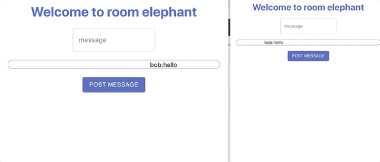

## About my-chat-app-client

This project was built using creat-react-app and is the client side of a chat app where the user can sign up, create rooms, and join a chat room.

It is used in conjunction with my-chat-app-server.

## Technologies used

- React, socket.io, React Hooks

## Installation and Quick Set Up

1. Clone the repository.
2. Navigate to the repository and run yarn start.
3. Open http://localhost:3000 to view it in the browser if it does not automatically open.
4. Make sure you run the server in https://github.com/AllanRaf/my-chat-app-server.
